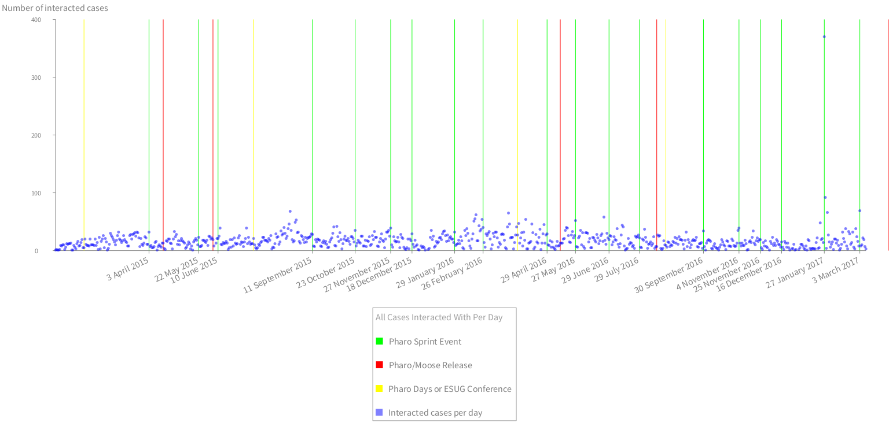

# FogBugzAnalyzer
FogBugz activity analysis support for Pharo http://fogbugz.com http://pharo.org


```
client := FBAClient new.
client login: 'your.email@domain.com' password: 'your password'.
client openedBetween: '01-Jan-2015' asDateAndTime and: DateAndTime tomorrow.
client fixCasesOfEvents "events should keep real cases, let's fix it".
```


```
(FBARoassalGrapher client: client)
	computeEventsPerDay;
	beStatic;
	addLegend: 'All developer events (actions) per day';
	timelineEventsPerDay.
```



```
(FBARoassalGrapher client: client)
	computeEventsPerDay;
	beStatic;
	addLegend: 'All cases interacted with per day';
	timelineCasesInteractedWithPerDay.
```


```
(FBARoassalGrapher client: client)
	computeEventsPerDay;
	beStatic;
	addLegend: 'Active developers per day';
	timelineActiveDevelopesPerDay.
```


```
(FBARoassalGrapher client: client)
	computeEventsPerDay;
	beStatic;
	addLegend: 'Number of event (action) types per day';
	timelineEventActionsPerDay.
```


```
(FBARoassalGrapher client: client)
	computeEventsPerDay;
	beStatic;
	addLegend: 'Open/Closed/Fixed/Resolved events per day';
	addImportantDates;
	addImportantDatesOnAxisX;
	timelineDataSelector: #newTimelineDataConnectedDotShapeColored:;
	addOpenedEventsPerDay;
	addClosedEventsPerDay;
	"addReactivatedEventsPerDay;"
	"addReopenedEventsPerDay;"
	addResolvedEventsPerDay;
	addResolvedFixReviewNeededEventsPerDay;
	"addAssignedEventsPerDay;"
	"addEditedEventsPerDay;"
	configureAxisXAndYForEvents;
	build
```
