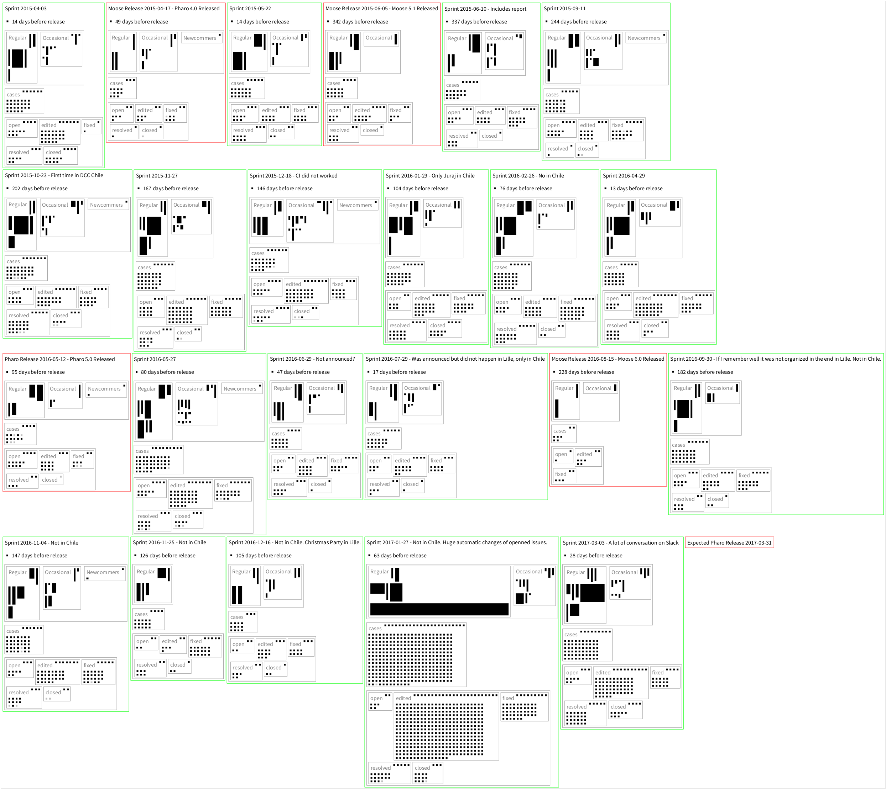

# FogBugzAnalyzer

FogBugz activity analysis support for Pharo http://fogbugz.com http://pharo.org


## Installation

```
Metacello new
	baseline: #FogBugzAnalyzer;
	repository: 'github://JurajKubelka/FogBugzAnalyzer/src';
	load.
```

## Usage

```
client := FBAClient new.
client login: 'your.email@domain.com' password: 'your password'.
client openedBetween: '01-Jan-2015' asDateAndTime and: DateAndTime tomorrow.
client fixCasesOfEvents "events should keep real cases, let's fix it".
```

The following figures represent data from ** January 1st 2015 to March
9 2017**. By *event* we usually refer to an action done in the issue
tracker. A *case* is a one specific entry (bug). By a *real case* we
understand a cases that is not an introduction case. An *introduction
case* is a case created automatically by the issue tracker system for
new users.

The up-to-date scripts for each diagram are available in
`FBARoassalExport` class.

## Results Per Day

### Number of All User Events of Real Cases Per Day


```
(FBARoassalGrapher client: client)
	computeEventsPerDay;
	beStatic;
	addLegend: 'All developer events (actions) per day';
	timelineEventsPerDay.
```

### Number of All Real Cases Per Day


```
(FBARoassalGrapher client: client)
	computeEventsPerDay;
	beStatic;
	addLegend: 'All cases interacted with per day';
	timelineCasesInteractedWithPerDay.
```

### Number of Active Developers Per Day


```
(FBARoassalGrapher client: client)
	computeEventsPerDay;
	beStatic;
	addLegend: 'Active developers per day';
	timelineActiveDevelopesPerDay.
```

### Number of Different Event Types Per Day

There are several events (actions) that can be done for each case
tracker, e.g., open a new case, edit an existing case, resolve (fix)
an existing case, close a case.


```
(FBARoassalGrapher client: client)
	computeEventsPerDay;
	beStatic;
	addLegend: 'Number of event (action) types per day';
	timelineEventActionsPerDay.
```

### Number of Some Specific Events Per Day


```
(FBARoassalGrapher client: client)
	computeEventsPerDay;
	beStatic;
	addLegend: 'Open/Closed/Fixed/Resolved events per day';
	addImportantDates;
	addImportantDatesOnAxisX;
	timelineDataSelector: #newTimelineDataConnectedDotShapeColored:;
	addOpenedEventsPerDay;
	addClosedEventsPerDay;
	"addReactivatedEventsPerDay;"
	"addReopenedEventsPerDay;"
	addResolvedEventsPerDay;
	addResolvedFixReviewNeededEventsPerDay;
	"addAssignedEventsPerDay;"
	"addEditedEventsPerDay;"
	configureAxisXAndYForEvents;
	build
```

## Results Per Event (Time Interval)

The previous graphs display results for each day which we consider too
detailed. It is hard to notice any interesating behavior pattern.

We thus introduce two concepts: `FBAEvent` and `FBAActivity`.
 - `FBAEvent` knows starting and ending date af an event, e.g., Pharo Sprint, ESUG Conference, Pharo Release Day.
 - `FBAActivity` holds a `FBAEvent` and a collection of `FogBugzEvent` objects (events). 
 - `FogBugzEvent` is an action triggered on a case (issue) that we already discussed above, e.g., opening, editing, resolving, closing.

```
activities := client activitiesWithUserEventsOfRealCases.
```

### Number of Active Developers During Each Time Interval

Here, we could all active developers during each time
interval. More longer time intervals, more active developers.


```
(FBARoassalActivities activities: activities)
	beStatic;
	addImportantDates;
	addImportantDatesOnAxisX;
	timelineDataSelector: #newTimelineDataConnectedDotShapeColored:;
	addActiveDevelopers;
	addLegend;
	configureAxisXAndY: 'Number of Developers per Activity';
	build.
```

### Number of Events Per Developer Per Day During Each Time Interval

Here, we count number of events (action on the issue tracker) for each
developer divided by number of days of a particular time interval.

We can notice more events during Pharo Sprints (green color) comparing to
normal days (grey color). Well, with lot of out-layers.

We exclude the two specific days (Apr 27 and March 3), because there were many automatic
case tagging. We could exclude such events in order to visualize those
specific Pharo Sprint days.


```
(FBARoassalActivities activities: (activities 
	reject: [ :activity | 
		(activity includesDate: '2017-01-27' asDateAndTime) or: [ 
			activity includesDate: '2017-03-03' asDateAndTime ] ]))
	beStatic;
	addDeveloperEventsPerActivityWithoutTimeline;
	addDatesOnAxisXWithoutTimeline;
	configureAxisXAndY: 'Developer Events per Activity without Apr 27 and March 3 2017';
	build.
```

## Introduction Cases

Introduction cases are created whenever a user sign-ups to the issue tracker.

### Number of Introduction Cases Per Day


```
(FBARoassalClient client: client)
   	computeUserEventsOfRealCasesPerDay;
	beStatic;
   	addLegend: 'Introduction Cases For New Sign-up Users per Day';
   	addImportantDates;
   	addImportantDatesOnAxisX;
   	addIntroCases;
 	configureAxisXAndY: 'Number of Intro Cases In One Day';
	build.
```

### Number of Introduction Cases During Time Interval


```
(FBARoassalActivities activities: client activitiesWithAllEvents)
	beStatic;
	addImportantDates;
	addImportantDatesOnAxisX;
	timelineDataSelector: #newTimelineDataConnectedDotShapeColored:;
	addIntroCases;
	addLegend;
	configureAxisXAndY: 'Number of Intro Cases During Activity';
	build.
```

### Number of Introduction Cases Per Day During Time Interval


```
(FBARoassalActivities activities: client activitiesWithAllEvents)
	beStatic;
	addImportantDates;
	addImportantDatesOnAxisX;
	timelineDataSelector: #newTimelineDataConnectedDotShapeColored:;
	addIntroCasesMeanPerDay;
	configureAxisXAndY: 'Number of Introduction Cases During Activity';
	addLegend;
	build.
```

## Blueprint



```
(FBASprintBlueprint activities: client activitiesWithUserEventsOfRealCases)
	buildSuch: [ :activity | activity isSprint or: [ activity isRelease ] ].
```

