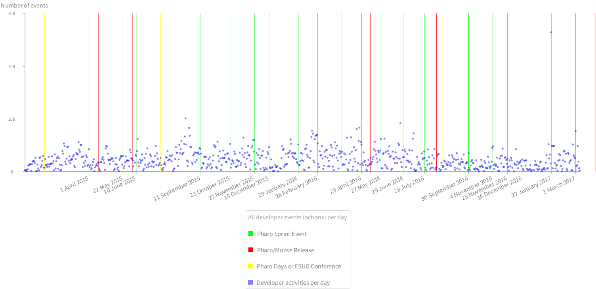
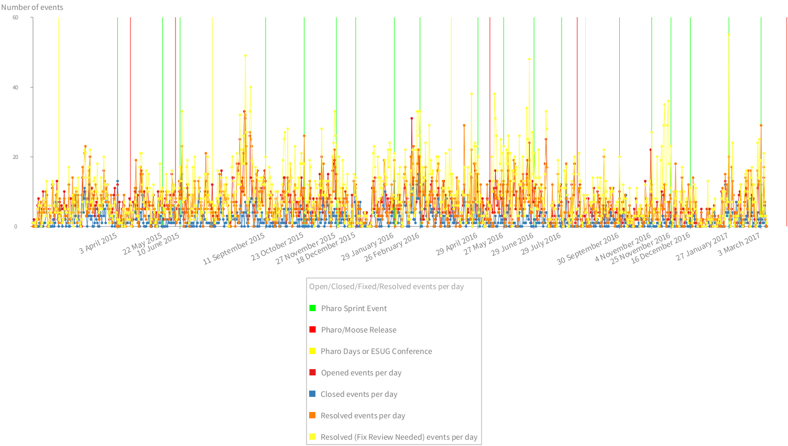
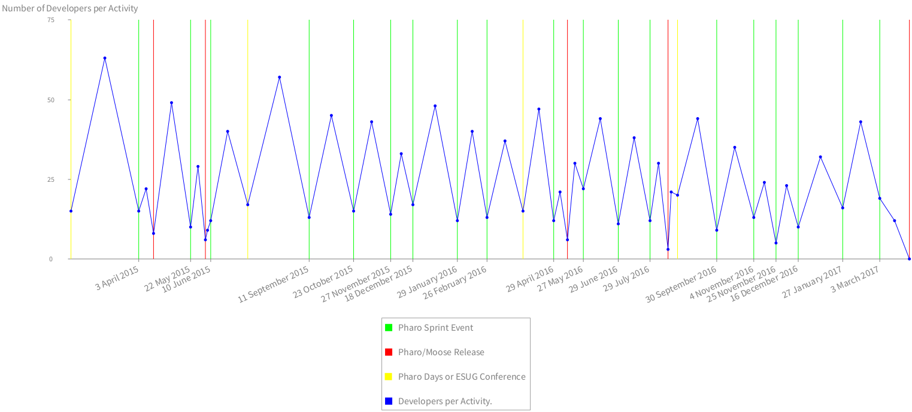

# FogBugzAnalyzer
FogBugz activity analysis support for Pharo http://fogbugz.com http://pharo.org


```
client := FBAClient new.
client login: 'your.email@domain.com' password: 'your password'.
client openedBetween: '01-Jan-2015' asDateAndTime and: DateAndTime tomorrow.
client fixCasesOfEvents "events should keep real cases, let's fix it".
```



```
(FBARoassalGrapher client: client)
	computeEventsPerDay;
	beStatic;
	addLegend: 'All developer events (actions) per day';
	timelineEventsPerDay.
```


```
(FBARoassalGrapher client: client)
	computeEventsPerDay;
	beStatic;
	addLegend: 'All cases interacted with per day';
	timelineCasesInteractedWithPerDay.
```


```
(FBARoassalGrapher client: client)
	computeEventsPerDay;
	beStatic;
	addLegend: 'Active developers per day';
	timelineActiveDevelopesPerDay.
```


```
(FBARoassalGrapher client: client)
	computeEventsPerDay;
	beStatic;
	addLegend: 'Number of event (action) types per day';
	timelineEventActionsPerDay.
```



```
(FBARoassalGrapher client: client)
	computeEventsPerDay;
	beStatic;
	addLegend: 'Open/Closed/Fixed/Resolved events per day';
	addImportantDates;
	addImportantDatesOnAxisX;
	timelineDataSelector: #newTimelineDataConnectedDotShapeColored:;
	addOpenedEventsPerDay;
	addClosedEventsPerDay;
	"addReactivatedEventsPerDay;"
	"addReopenedEventsPerDay;"
	addResolvedEventsPerDay;
	addResolvedFixReviewNeededEventsPerDay;
	"addAssignedEventsPerDay;"
	"addEditedEventsPerDay;"
	configureAxisXAndYForEvents;
	build
```

Introduces two concepts: `FBAEvent` and `FBAActivity`.
 - `FBAEvent` knows starting and ending date
 - `FBAActivity` holds a `FBAEvent` and a collection of `FogBugzEvent` objects. 
 - `FogBugzEvent` is an action triggered on a case (issue), e.g., opening, editing, resolving, closing.


```
activities := client eventActivitiesWithInBetweenDays.
```



```
(FBARoassalActivities activities: activities)
	beStatic;
	addImportantDates;
	addImportantDatesOnAxisX;
	timelineDataSelector: #newTimelineDataConnectedDotShapeColored:;
	addActiveDevelopers;
	addLegend;
	configureAxisXAndY: 'Number of Developers per Activity';
	build.
```


```

(FBARoassalActivities activities: (activities 
	reject: [ :activity | 
		(activity includesDate: '2017-01-27' asDateAndTime) or: [ 
			activity includesDate: '2017-03-03' asDateAndTime ] ]))
	beStatic;
	addDeveloperEventsPerActivityWithoutTimeline;
	addDatesOnAxisXWithoutTimeline;
	configureAxisXAndY: 'Developer Events per Activity without Apr 27 and March 3 2017';
	build.
```

We exclude the two specific days, because there were many automatic case tagging. We could exclude such events in order to visualize those specific Pharo Sprint days.
